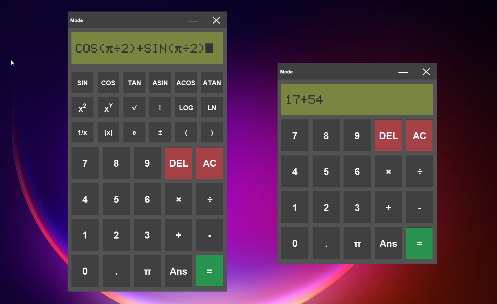

# Kasio

[](https://github.com/hethon/Kasio/actions)
[](https://github.com/hethon/Kasio/releases)
[](https://github.com/pre-commit/pre-commit)


Kasio is a Java Swing calculator app built for a university assignment, featuring a retro design inspired by classic scientific calculators.



Swing wasn’t a deliberate tech choice, it was required by the course, but I used the project to go beyond that constraint and explore better software practices. The true focus of this repository is learning tooling and architecture.

During the development process, I learned and implemented:
* **Gradle:** Migrated the project to a standard build system instead of relying on IDE tooling.
* **MVC Architecture:** Completely refactored the codebase to decouple the UI components from the main application logic and eliminate circular dependencies.

I am continuing to use this project as a hands-on way to learn new software engineering concepts. Upcoming goals include:
- [x] Adding unit tests (JUnit).
- [x] Setting up CI/CD pipelines.
- [x] Tag-triggered release workflow.
- [ ] Automated semantic versioning.

### How to Run
You don't need Gradle installed globally. Just use the included wrapper:

```bash
# Mac/Linux
./gradlew run

# Windows
gradlew run
```
